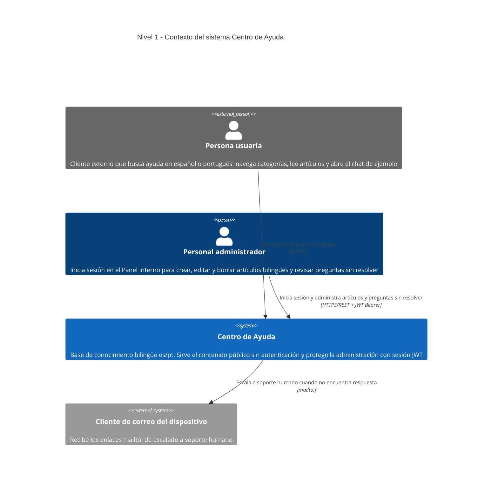

# C4 · Nivel 1 — Diagrama de contexto

**Última revisión:** 2026-08-01 · **Commit de referencia:** `a6670ab` · **Rama:** `pruebas-ejecucion-y-afinado-de-agentes`

> Revisar este diagrama cuando aparezca un sistema externo nuevo: una integración de correo, un
> proveedor de IA, analítica o pasarela de pago. Mientras el sistema no llame a nadie más, sigue
> vigente.

El **Centro de Ayuda** es una base de conocimiento bilingüe (español y portugués) con un panel interno
de administración. Las personas usuarias consultan categorías y artículos; el personal administrador
inicia sesión para gestionar los artículos y revisar las preguntas que el sistema no supo resolver.

Este diagrama refleja **únicamente lo que existe en el código** del repositorio. Todo elemento aquí
dibujado tiene respaldo en un archivo concreto; lo que no puede determinarse desde el código está
marcado con `%% TODO: confirmar`.

## Cómo leer este diagrama

Notación [C4](https://c4model.com), nivel 1:

- **Persona** — alguien que usa el sistema. En azul oscuro si es interna a la organización, en gris si
  es externa.
- **Sistema** — la caja azul del centro: todo lo que construimos, visto desde fuera y sin abrir.
- **Sistema externo** — en gris: software que no controlamos pero del que dependemos.
- **Flecha** — una interacción real, etiquetada con su propósito y su protocolo.

El detalle interno de la caja azul está en
[`c4-level2-container.md`](./c4-level2-container.md).

## Pendiente de confirmar

Lo que no se puede deducir del código. No son suposiciones: son preguntas abiertas.

- **A dónde escala el correo de soporte.** Los enlaces `mailto:` apuntan a
  `soporte@empresa.example`, un dominio de ejemplo heredado del prototipo
  (`app/src/components/EscalationBlock.tsx`). Hace falta la dirección real de atención al cliente.
- **Si el sistema tendrá dominio público y cómo se desplegará.** Hoy todo corre en local y no hay
  configuración de despliegue en el repositorio. Hay un plan preliminar en
  [`docs/plans/infra-centro-ayuda-preliminar.md`](../plans/infra-centro-ayuda-preliminar.md).

## Qué NO aparece, y por qué

- **Ningún proveedor de IA ni servicio de LLM.** El widget de chat muestra una conversación guionizada
  que viene del propio contenido (`app/src/components/ChatWidget.tsx`); el campo de entrada y el botón
  de enviar no tienen comportamiento. No hay ningún SDK ni llamada HTTP saliente en `api/`. Está
  diseñado, no construido: [`docs/plans/rag-centro-ayuda-preliminar.md`](../plans/rag-centro-ayuda-preliminar.md).
- **Ningún servicio de correo, almacenamiento o analítica.** El backend no realiza llamadas HTTP
  salientes de ningún tipo. El único servicio externo al que el sistema hace una petición de red es el
  CDN de tipografías (`app/src/index.css:1`); el cliente de correo se abre en el dispositivo, no se le
  llama.
- **RAG y búsqueda semántica.** La extensión `vector` se habilita en la migración inicial y ninguna
  tabla la usa. El diseño está en
  [`docs/plans/rag-centro-ayuda-preliminar.md`](../plans/rag-centro-ayuda-preliminar.md).

## Referencias en el código

| Elemento | Origen |
| --- | --- |
| Sistema Centro de Ayuda | `app/` (Next.js) + `api/` (FastAPI) + `docker-compose.yml` |
| Personas usuarias / administradoras | `app/app/[idioma]/` (rutas públicas), `app/proxy.ts` (guardia del panel), `api/app/deps.py` |
| Enlaces `mailto:` | `app/app/_componentes/EscalacionBloque.tsx`, `app/app/_componentes/ChatWidget.tsx`, `app/app/_componentes/BuscadorAyuda.tsx` |

Ver el detalle interno en [`c4-level2-container.md`](./c4-level2-container.md).
