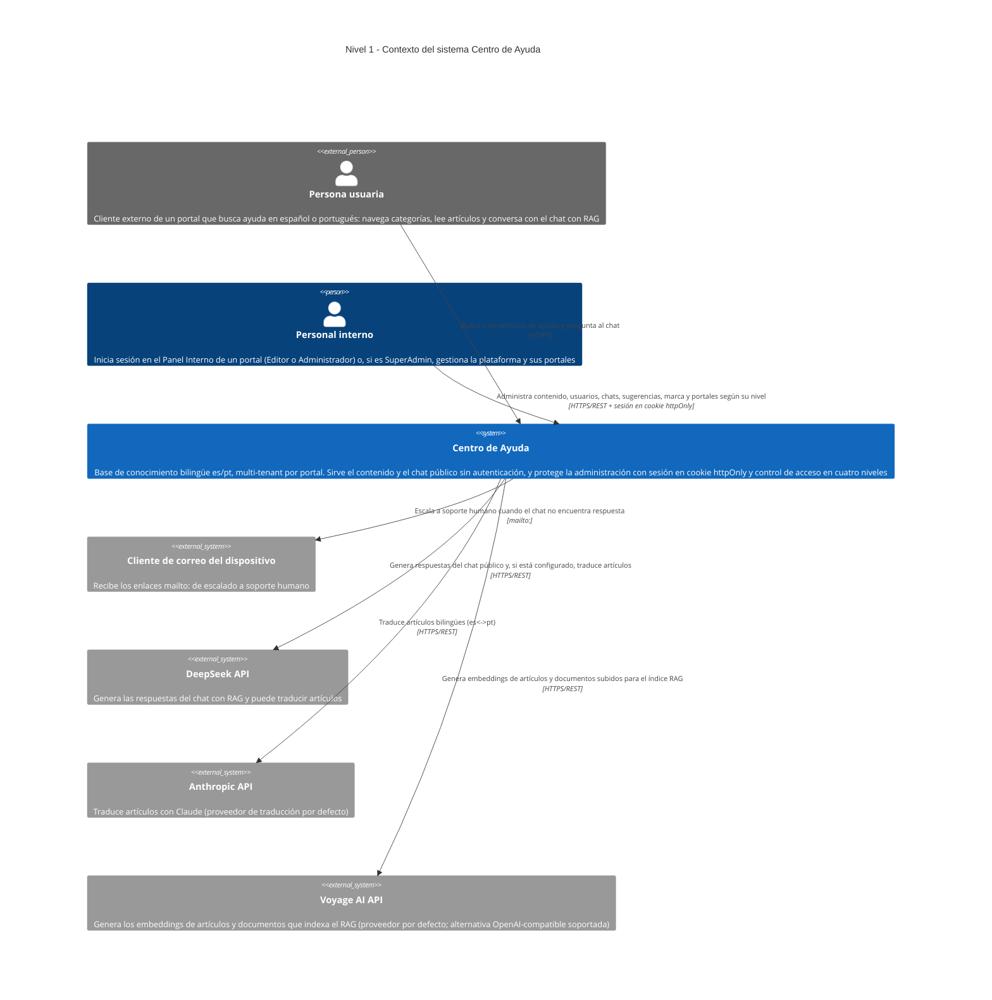

# C4 · Nivel 1 — Diagrama de contexto

**Última revisión:** 2026-08-20 · **Commit de referencia:** `be0e8cd` · **Rama:** `actualizacion-documentacion`

> Revisar este diagrama cuando aparezca un sistema externo nuevo: una integración de correo, un
> proveedor de IA, analítica o pasarela de pago. Mientras el sistema no llame a nadie más, sigue
> vigente.

El **Centro de Ayuda** es una base de conocimiento bilingüe (español y portugués), **multi-tenant por
portal**: una sola instalación sirve a varios clientes, cada uno con su propio subdominio (o dominio
propio). Las personas usuarias consultan categorías y artículos, y pueden preguntarle al **chat con RAG**
del portal; el personal interno inicia sesión en el Panel Interno para gestionar contenido, revisar
chats y preguntas sin resolver, y —según su nivel— administrar usuarios, la marca del portal o la
plataforma completa.

Este diagrama refleja **únicamente lo que existe en el código** del repositorio. Todo elemento aquí
dibujado tiene respaldo en un archivo concreto; lo que no puede determinarse desde el código está
marcado con `%% TODO: confirmar`.

## Cómo leer este diagrama

Notación [C4](https://c4model.com), nivel 1:

- **Persona** — alguien que usa el sistema. En azul oscuro si es interna a la organización, en gris si
  es externa.
- **Sistema** — la caja azul del centro: todo lo que construimos, visto desde fuera y sin abrir.
- **Sistema externo** — en gris: software que no controlamos pero del que dependemos.
- **Flecha** — una interacción real, etiquetada con su propósito y su protocolo.

El detalle interno de la caja azul está en
[`c4-level2-container.md`](./c4-level2-container.md).

## Pendiente de confirmar

Lo que no se puede deducir del código. No son suposiciones: son preguntas abiertas.

- **A dónde escala el correo de soporte.** Los enlaces `mailto:` siguen apuntando a
  `soporte@empresa.example`, un dominio de ejemplo heredado del prototipo
  (`app/app/_componentes/ChatWidget.tsx`, `EscalacionBloque.tsx`). El cambio OpenSpec
  `configurar-correo-soporte` (propuesto, sin implementar) sustituirá este `mailto:` fijo por una
  dirección configurable por portal.
- **Si el sistema tendrá dominio público y cómo se desplegará.** Hoy todo corre en local (`localhost` /
  `<slug>.localhost`) y no hay configuración de despliegue en el repositorio. El cambio OpenSpec
  `infraestructura-despliegue` está propuesto pero no implementado; hay un plan preliminar en
  [`docs/plans/infra-centro-ayuda-preliminar.md`](../plans/infra-centro-ayuda-preliminar.md).

## Qué NO aparece, y por qué

- **Ningún servicio de correo, almacenamiento, analítica o pasarela de pago.** El backend no hace
  llamadas HTTP salientes salvo a los tres proveedores de IA listados arriba (chat, traducción,
  embeddings); el cliente de correo se abre en el dispositivo de la persona usuaria, no se le llama por
  red. Las tipografías de marca (DM Sans, DM Serif Display) se autoalojan con `next/font` y ya no
  dependen de un CDN externo en tiempo de ejecución.
- **Ningún proveedor de IA distinto de DeepSeek, Anthropic y Voyage AI (u otro OpenAI-compatible para
  embeddings).** `api/app/servicios_ia.py` es el único punto del backend que abre una conexión saliente
  hacia un LLM o un servicio de embeddings; los tres roles (chat, traducción, embeddings) se resuelven
  ahí y solo esos motores tienen implementación real (`PROVEEDORES_CHAT`, `PROVEEDORES_TRADUCCION`,
  `PROVEEDORES_EMBEDDINGS`).

## Referencias en el código

| Elemento | Origen |
| --- | --- |
| Sistema Centro de Ayuda | `app/` (Next.js) + `api/` (FastAPI) + `docker-compose.yml` |
| Personas usuarias / personal interno | `app/app/[idioma]/` (rutas públicas y panel), `app/proxy.ts` (guardia del panel), `api/app/deps.py` (`requiere_nivel`, `NivelAcceso`) |
| Chat con RAG | `app/app/_componentes/ChatWidget.tsx`, `app/app/api/[idioma]/chat/consultar/route.ts`, `api/app/routers/chat.py`, `api/app/chat.py`, `api/app/recuperador.py` |
| Enlaces `mailto:` | `app/app/_componentes/EscalacionBloque.tsx`, `app/app/_componentes/ChatWidget.tsx`, `app/app/_componentes/BuscadorAyuda.tsx` |
| Proveedores de IA | `api/app/servicios_ia.py` (chat, traducción, embeddings), `api/app/routers/admin_config_ia.py` (configuración por rol, SuperAdmin), `api/app/cifrado.py` (claves cifradas en reposo) |

Ver el detalle interno en [`c4-level2-container.md`](./c4-level2-container.md).
