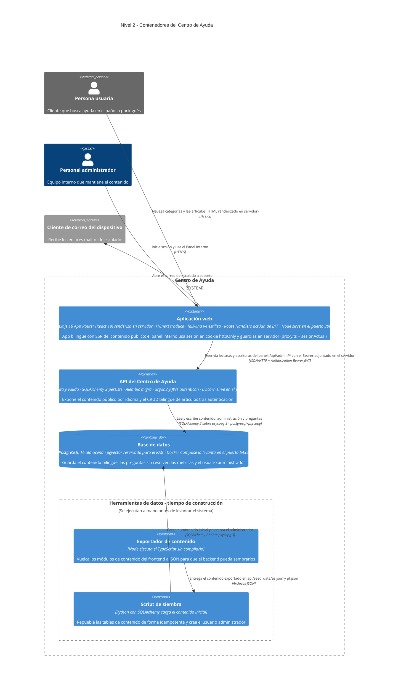

# C4 · Nivel 2 — Diagrama de contenedores

**Última revisión:** 2026-08-10 · **Rama:** `panel-pestanas` (cambio OpenSpec `migrar-frontend-nextjs`)

> Revisar este diagrama al modificar `app/package.json`, `app/next.config.mjs`, `app/proxy.ts`,
> `api/pyproject.toml`, `docker-compose.yml`, `api/app/routers/` o `app/src/data/`.

Detalle interno del sistema descrito en [`c4-level1-context.md`](./c4-level1-context.md).

Son **cinco contenedores**: tres en ejecución (la aplicación web Next.js, la API y la base de datos) y dos
scripts de tiempo de construcción que preparan el contenido inicial y se ejecutan a mano, nunca en
producción. Cada tecnología y cada relación proviene de un archivo del repositorio; lo indeterminable está
marcado con `%% TODO: confirmar`.

> **Migración en curso (`migrar-frontend-nextjs`):** el frontend pasó de SPA (React + Vite + react-router,
> token en `localStorage`) a **Next.js con renderizado en servidor y sesión en cookie `httpOnly` (BFF)**.
> El navegador ya no custodia el token ni envía el `Bearer`: lo hace la propia app Next en el servidor.

## Cómo leer este diagrama

Notación [C4](https://c4model.com), nivel 2:

- **Persona** — alguien que usa el sistema. En azul oscuro si es interna a la organización, en gris si
  es externa.
- **Contenedor** — una unidad que se ejecuta por separado y se puede desplegar sola: una aplicación,
  una API, una base de datos.
- **Sistema externo** — en gris: software que no controlamos pero del que dependemos.
- **Borde del sistema** — la línea de puntos que separa lo que construimos de lo que solo consumimos.
- **Flecha** — una interacción real, etiquetada con su propósito y su protocolo.

## Tecnologías y por qué

Las etiquetas del diagrama resumen; esta sección es la fuente de la verdad.

### Aplicación web (`app/`)

| Tecnología | Qué hace | Por qué aquí |
| --- | --- | --- |
| Next.js 16 (App Router) | Enruta por archivos, renderiza en servidor y aloja los Route Handlers del BFF | SSR del contenido público (HTML sin JS), sesión en cookie httpOnly y guardias en servidor; el idioma va en el primer segmento (`app/app/[idioma]/…`). Migración desde la SPA en `migrar-frontend-nextjs` |
| React 19 | Construye la interfaz como componentes de servidor y cliente | El prototipo de `design/` ya era una aplicación React con la accesibilidad resuelta: se reutilizaron sus componentes en lugar de reescribirlos |
| TypeScript 5.7 | Añade tipos estáticos que se comprueban antes de compilar | `src/types.ts` es el contrato compartido con la API; el typecheck de `next build` detecta desajustes con el JSON que sirve el backend |
| BFF por cookie httpOnly | Custodia el token JWT en el servidor y renueva con un refresh token opaco rotatorio | El navegador nunca ve el token; `proxy.ts` guarda el panel en el borde y reenvía el `Bearer` desde `app/app/api/*`. CSP con nonce en `proxy.ts` + cabeceras en `next.config.mjs` |
| Tailwind CSS v4 | Aplica estilos con clases de utilidad desde el propio marcado | Se integra vía `@tailwindcss/postcss`, sin archivo de configuración; el acento se expone como token `--acento` para recambiar la marca sin tocar componentes |
| i18next (+ react-i18next) | Resuelve las etiquetas de interfaz según el idioma activo | Traductor **isomórfico** (`getFixedT`) en Server y Client Components; react-i18next se conserva solo para los componentes reutilizados del panel |
| Vitest 3 | Ejecuta los tests unitarios | Corre en entorno `node` sin DOM: cubre solo lógica pura, y así el proyecto evita introducir jsdom y Testing Library (necesita Vite instalado, de ahí que siga en devDependencies) |

### API (`api/`)

| Tecnología | Qué hace | Por qué aquí |
| --- | --- | --- |
| Python 3.11+ | Lenguaje del backend | Se eligió por el RAG futuro: el ecosistema de recuperación y *embeddings* vive en Python |
| FastAPI | Framework web ASGI: enruta las peticiones HTTP y valida entrada y salida | Genera la documentación OpenAPI en `/docs` y permite que los esquemas reproduzcan `src/types.ts` campo a campo |
| Pydantic 2 | Declara y valida los esquemas de datos de la API | Los esquemas se serializan en camelCase para coincidir con el contrato del frontend sin capa de traducción |
| pydantic-settings | Lee la configuración desde variables de entorno y `.env` | Mantiene los secretos fuera del repo; la aplicación no arranca si falta `JWT_SECRET` |
| SQLAlchemy 2 | ORM: mapea las tablas a clases Python y construye el SQL | Soporta el modelo bilingüe de entidad estable más traducciones y, con `JSON().with_variant(JSONB())`, deja correr los tests en SQLite |
| Alembic | Versiona los cambios de esquema como migraciones ejecutables | Crea el esquema inicial y habilita `CREATE EXTENSION vector` desde la primera migración |
| psycopg 3 | Driver que conecta Python con PostgreSQL | Es el driver del dialecto `postgresql+psycopg` que usa la cadena de conexión |
| uvicorn | Servidor ASGI que ejecuta la aplicación | Servidor de referencia de FastAPI; recarga en caliente durante el desarrollo |
| argon2-cffi | Deriva y verifica el hash de la contraseña del administrador | Ganador del Password Hashing Competition: coste ajustable y resistente a ataques con GPU; la contraseña nunca se guarda recuperable |
| PyJWT | Firma y verifica el token de sesión HS256 | Sesión sin estado en el servidor; el token caduca a los 60 minutos y se valida en cada petición a `/api/admin/*` |
| pytest + httpx | Ejecutan las pruebas del backend | `TestClient` de FastAPI necesita httpx; las pruebas corren contra SQLite en memoria, sin depender de Docker |

### Base de datos

| Tecnología | Qué hace | Por qué aquí |
| --- | --- | --- |
| PostgreSQL 16 | Motor relacional que almacena y consulta los datos | Única base de datos del sistema: contenido, administración y métricas (filas de la tabla `metricas` sembradas por `seed.py`, no cálculos derivados) |
| pgvector | Añade el tipo `vector` y los índices de similitud | Se habilita desde la primera migración para no tener que cambiar de motor cuando llegue el RAG. **Hoy ninguna tabla lo usa** |
| Docker Compose | Levanta el servicio de base de datos | Entorno reproducible: puerto atado a `127.0.0.1`, volumen `pgdata` y *healthcheck* |

### Herramientas de datos

| Tecnología | Qué hace | Por qué aquí |
| --- | --- | --- |
| Node con *type stripping* | Ejecuta el exportador leyendo los módulos TypeScript directamente | Evita un paso de compilación para un script que solo se ejecuta al preparar el contenido |
| SQLAlchemy en `seed.py` | Vacía y repuebla las tablas de contenido de forma idempotente | Reutiliza los mismos modelos que la API, así el seed no puede divergir del esquema |

## Pendiente de confirmar

Lo que no se puede deducir del código. No son suposiciones: son preguntas abiertas.

- **Artefacto de despliegue de la app Next.** Con la migración, el frontend deja de ser un estático y
  pasa a ser un **servicio Node** (`next start`) que además hace de BFF hacia la API. En desarrollo Next
  reescribe `/api/(es|pt)/*` a `http://127.0.0.1:8000` (`app/next.config.mjs`, `BACKEND_ORIGIN`) y el panel
  usa Route Handlers; la API no registra CORS, así que el backend solo debería ser accesible desde la app
  Next (red interna). El endurecimiento por entorno (cookies `Secure`, HSTS, `__Host-`) y este cambio de
  artefacto los cierra el cambio `infraestructura-despliegue`; hay un plan preliminar en
  [`docs/plans/infra-centro-ayuda-preliminar.md`](../plans/infra-centro-ayuda-preliminar.md).
- **Qué papel jugará pgvector.** La extensión se habilita en la primera migración
  (`api/alembic/versions/0001_inicial.py`) y ninguna tabla la usa. El diseño está en
  [`docs/plans/rag-centro-ayuda-preliminar.md`](../plans/rag-centro-ayuda-preliminar.md), sin
  implementar.

## Notas de lectura

- **La app Next es hoy la única consumidora de la API**, y lo hace **desde el servidor**: el contenido
  público con `cargarContenidoServidor` (`app/src/data/servidor.ts`) y el panel con los Route Handlers del
  BFF (`app/app/api/*`). El navegador solo habla con Next (mismo origen); Next llama al backend.
- **El contenido público se renderiza en servidor.** Los Server Components de `app/app/[idioma]/` traen el
  HTML con el contenido dentro; los módulos `app/src/data/{es,pt}/` solo alimentan al exportador y a los
  tests de paridad es/pt.
- **La protección del panel se resuelve en servidor.** `app/proxy.ts` guarda `/(es|pt)/panel*` en el borde
  (renueva con el refresh token si hace falta) y las páginas comprueban la sesión con `sesionActual()`
  (`GET /api/auth/me`), sin descodificar el JWT en el cliente. La autorización real (nivel, `activo`) la
  impone el backend en cada petición a `/api/admin/*`.
- **La sesión vive en cookies `httpOnly`.** `ca_sesion` (access JWT) y `ca_refresh` (refresh opaco
  rotatorio) las fija y renueva el BFF (`app/src/bff/cookies.ts`); el token nunca llega a JavaScript.
- **`POST /api/auth/logout` sí se consume ahora**: el cierre de sesión revoca la familia del refresh token
  en el backend y borra las cookies (antes el logout era local). Siguen sin consumirse `GET /api/salud` y
  `GET /api/admin/articulos` (el panel lista desde el contenido público).
- **Las fuentes de marca se autoalojan.** DM Sans y DM Serif Display se descargan en la compilación con
  `next/font` (`app/app/[idioma]/layout.tsx`) y se sirven desde el mismo origen (`/_next/static/media/…`);
  por eso Google Fonts **ya no es una dependencia de runtime** y la CSP no necesita abrir `font-src` a
  dominios externos.
- **El chat no es una integración.** Renderiza una conversación fija del contenido, con citas que
  enlazan a artículos reales; no hay generación de respuestas.
- **El idioma vive en la ruta.** El primer segmento (`/es/…`, `/pt/…`) fija `<html lang>`; cada página
  carga **un** idioma y el selector obtiene el slug equivalente del otro **bajo demanda** en el cliente
  (`app/app/_componentes/SelectorIdioma.tsx`).
- **El modelo de datos es bilingüe por construcción.** Cada entidad tiene una fila estable y una fila
  de traducción por idioma, con las partes anidadas en JSONB (`api/app/models.py`). Por eso crear o
  editar un artículo exige español y portugués a la vez.
- **El orden de arranque importa.** `docker compose up -d` levanta Postgres, `alembic upgrade head`
  crea el esquema y la extensión `vector`, `node ../app/scripts/exportar-datos.mjs` vuelca el contenido
  a JSON y `python seed.py` lo siembra —este último falla si la migración no se ha aplicado antes—;
  solo entonces `uvicorn app.main:app --reload` sirve la API (`api/README.md`). En desarrollo hace falta
  además `npm run dev` en `app/` (la app Next, que reescribe `/api` al backend).

## Referencias en el código

| Contenedor | Archivos clave |
| --- | --- |
| Aplicación web | `app/package.json`, `app/next.config.mjs`, `app/proxy.ts`, `app/app/[idioma]/`, `app/app/api/`, `app/src/data/servidor.ts`, `app/src/bff/`, `app/src/data/admin.ts` |
| API | `api/pyproject.toml`, `api/app/main.py`, `api/app/routers/`, `api/app/security.py`, `api/app/deps.py`, `api/app/servicios.py` |
| Base de datos | `docker-compose.yml`, `api/app/database.py`, `api/app/models.py`, `api/alembic/versions/0001_inicial.py` |
| Exportador | `app/scripts/exportar-datos.mjs` |
| Siembra | `api/seed.py` |
