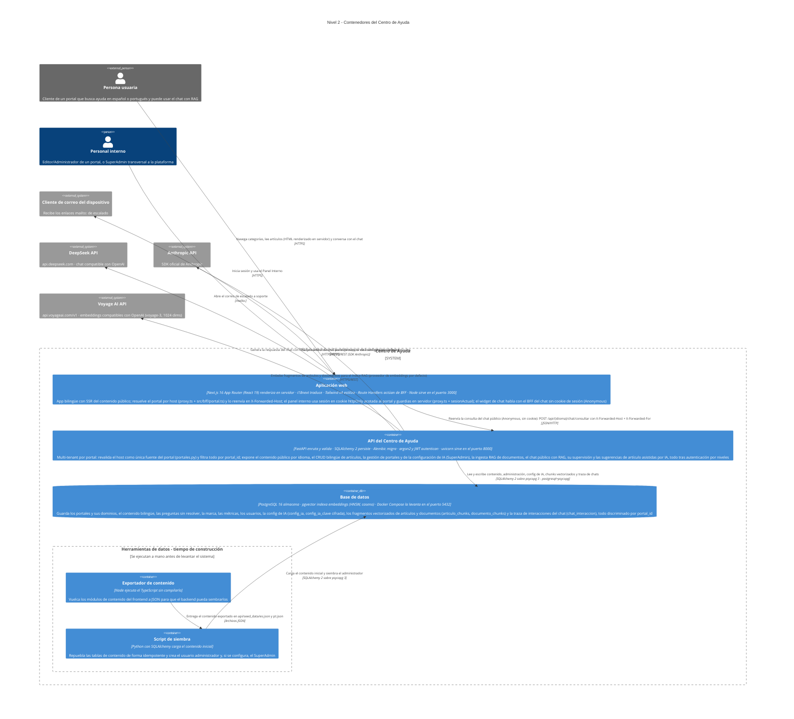

# C4 · Nivel 2 — Diagrama de contenedores

**Última revisión:** 2026-08-20 · **Commit de referencia:** `be0e8cd` · **Rama:** `actualizacion-documentacion`

> Revisar este diagrama al modificar `app/package.json`, `app/next.config.mjs`, `app/proxy.ts`,
> `api/pyproject.toml`, `docker-compose.yml`, `api/app/routers/`, `api/app/models.py`,
> `api/app/servicios_ia.py`, `api/app/portales.py` o `app/src/bff/`.

Detalle interno del sistema descrito en [`c4-level1-context.md`](./c4-level1-context.md).

Son **cinco contenedores**: tres en ejecución (la aplicación web Next.js, la API y la base de datos) y dos
scripts de tiempo de construcción que preparan el contenido inicial y se ejecutan a mano, nunca en
producción. Cada tecnología y cada relación proviene de un archivo del repositorio; lo indeterminable está
marcado con `%% TODO: confirmar`.

> **Frontend en Next.js con BFF (`migrar-frontend-nextjs`, archivado).** El frontend dejó de ser una SPA
> (React + Vite + react-router, token en `localStorage`) y es **Next.js con renderizado en servidor y
> sesión en cookie `httpOnly`**. El navegador nunca custodia el token ni envía el `Bearer`: lo hace la
> propia app Next en el servidor.

> **Multi-tenant por portal (`multi-tenant-portales`, archivado).** La misma imagen y la misma base de
> datos sirven a varios clientes. Cada petición se atribuye a un **portal (tenant)** resolviendo su
> **host**: el borde de Next lo resuelve (`app/proxy.ts`, `src/bff/portal.ts`) y lo reenvía al backend en
> `X-Forwarded-Host`; el backend lo revalida (`app/portales.py`) como **única** fuente del portal (nunca
> del cliente). Todos los datos se discriminan por `portal_id` y toda consulta filtra por él; la marca
> (logo, acento, empresa) y la sesión se acotan al portal. Un cuarto nivel **SuperAdmin** gestiona los
> portales y la configuración de IA de la plataforma.

> **Chat con RAG y sugerencias de artículo asistidas por IA (`chat-rag-portal`, `rag-ingesta`,
> `separar-proveedores-ia`, `chat-evals-brevedad-supervision`, `sugerir-articulos-ia`, todos archivados).**
> La API ahora llama a proveedores de IA externos (DeepSeek, Anthropic, Voyage AI) para responder el chat
> público, traducir artículos y generar embeddings; pgvector, habilitado desde la primera migración, está
> **en uso real** desde `documento_chunks` y `articulo_chunks`.

## Cómo leer este diagrama

Notación [C4](https://c4model.com), nivel 2:

- **Persona** — alguien que usa el sistema. En azul oscuro si es interna a la organización, en gris si
  es externa.
- **Contenedor** — una unidad que se ejecuta por separado y se puede desplegar sola: una aplicación,
  una API, una base de datos.
- **Sistema externo** — en gris: software que no controlamos pero del que dependemos.
- **Borde del sistema** — la línea de puntos que separa lo que construimos de lo que solo consumimos.
- **Flecha** — una interacción real, etiquetada con su propósito y su protocolo.

## Tecnologías y por qué

Las etiquetas del diagrama resumen; esta sección es la fuente de la verdad.

### Aplicación web (`app/`)

| Tecnología | Qué hace | Por qué aquí |
| --- | --- | --- |
| Next.js 16 (App Router) | Enruta por archivos, renderiza en servidor y aloja los Route Handlers del BFF | SSR del contenido público (HTML sin JS), sesión en cookie httpOnly y guardias en servidor; el idioma va en el primer segmento (`app/app/[idioma]/…`) |
| React 19 | Construye la interfaz como componentes de servidor y cliente | El prototipo de `design/` ya era una aplicación React con la accesibilidad resuelta: se reutilizaron sus componentes en lugar de reescribirlos |
| TypeScript 5.7 | Añade tipos estáticos que se comprueban antes de compilar | `src/types.ts` es el contrato compartido con la API; el typecheck de `next build` detecta desajustes con el JSON que sirve el backend |
| BFF por cookie httpOnly | Custodia el token JWT en el servidor y renueva con un refresh token opaco rotatorio | El navegador nunca ve el token; `proxy.ts` guarda el panel en el borde y reenvía el `Bearer` desde `app/app/api/*`. CSP con nonce en `proxy.ts` + cabeceras en `next.config.mjs`. El chat público (`app/app/api/[idioma]/chat/consultar/route.ts`) es la excepción deliberada: es Anonymous, no adjunta cookie de sesión, solo reenvía el host y la IP del cliente |
| Tailwind CSS v4 | Aplica estilos con clases de utilidad desde el propio marcado | Se integra vía `@tailwindcss/postcss`, sin archivo de configuración; el acento se expone como token `--acento` para recambiar la marca sin tocar componentes |
| i18next (+ react-i18next) | Resuelve las etiquetas de interfaz según el idioma activo | Traductor **isomórfico** (`getFixedT`) en Server y Client Components; react-i18next se conserva solo para los componentes reutilizados del panel |
| Vitest 3 | Ejecuta los tests unitarios | Corre en entorno `node` sin DOM: cubre solo lógica pura, y así el proyecto evita introducir jsdom y Testing Library (necesita Vite instalado, de ahí que siga en devDependencies) |

### API (`api/`)

| Tecnología | Qué hace | Por qué aquí |
| --- | --- | --- |
| Python 3.11+ | Lenguaje del backend | Se eligió por el RAG: el ecosistema de recuperación y *embeddings* vive en Python; hoy ese RAG ya está construido |
| FastAPI | Framework web ASGI: enruta las peticiones HTTP y valida entrada y salida | Genera la documentación OpenAPI en `/docs` y permite que los esquemas reproduzcan `src/types.ts` campo a campo |
| Pydantic 2 | Declara y valida los esquemas de datos de la API | Los esquemas se serializan en camelCase para coincidir con el contrato del frontend sin capa de traducción; la salida del LLM del chat se valida con `extra="forbid"` |
| pydantic-settings | Lee la configuración desde variables de entorno y `.env` | Mantiene los secretos fuera del repo; la aplicación no arranca si falta `JWT_SECRET` |
| SQLAlchemy 2 | ORM: mapea las tablas a clases Python y construye el SQL | Soporta el modelo bilingüe de entidad estable más traducciones, `JSON().with_variant(JSONB())` para contenido anidado y `Vector(EMBEDDING_DIM).with_variant(JSON(), "sqlite")` para embeddings, dejando correr los tests en SQLite sin pgvector instalado |
| Alembic | Versiona los cambios de esquema como migraciones ejecutables | Crea el esquema inicial y habilita `CREATE EXTENSION vector`; migraciones posteriores (`0008_rag_chunks` en adelante) añaden portales, config de IA y las tablas del RAG |
| psycopg 3 | Driver que conecta Python con PostgreSQL | Es el driver del dialecto `postgresql+psycopg` que usa la cadena de conexión |
| uvicorn | Servidor ASGI que ejecuta la aplicación | Servidor de referencia de FastAPI; recarga en caliente durante el desarrollo |
| argon2-cffi | Deriva y verifica el hash de la contraseña del administrador | Ganador del Password Hashing Competition: coste ajustable y resistente a ataques con GPU; la contraseña nunca se guarda recuperable |
| PyJWT | Firma y verifica el token de sesión HS256 | Sesión sin estado en el servidor; el token caduca a los 60 minutos y se valida en cada petición a `/api/admin/*` |
| `cryptography` (Fernet) | Cifra en reposo las claves de API de los proveedores de IA | `api/app/cifrado.py`; la clave simétrica vive en `CLAVE_CIFRADO_IA`, fuera del repo. Sin ella, la API arranca igual pero avisa de que faltan configurar las claves |
| SDK `anthropic` | Cliente oficial de Anthropic (Claude) | Traducción de artículos (proveedor por defecto); importado de forma perezosa en `api/app/servicios_ia.py` para no exigir el paquete cuando los tests sustituyen el proveedor |
| SDK `openai` | Cliente HTTP compatible con el shape OpenAI | Reutilizado para DeepSeek (chat y traducción) y para Voyage AI/OpenAI (embeddings), apuntando cada uno a su propia `base_url`: un único cliente cubre varios proveedores OpenAI-compatibles |
| pytest + httpx | Ejecutan las pruebas del backend | `TestClient` de FastAPI necesita httpx; las pruebas corren contra SQLite en memoria, sin depender de Docker. El harness EDD del chat (`api/tests/eval/`, marker `eval`, opt-in) mide contra un dataset por idioma con proveedor doble determinista, y opcionalmente contra el proveedor real (`--real`) |

### Base de datos

| Tecnología | Qué hace | Por qué aquí |
| --- | --- | --- |
| PostgreSQL 16 | Motor relacional que almacena y consulta los datos | Única base de datos del sistema: contenido, administración, métricas, config de IA y traza de chats, todo discriminado por `portal_id` |
| pgvector | Añade el tipo `vector` y los índices de similitud | **En uso real** desde `documento_chunks` y `articulo_chunks` (migración `0008_rag_chunks`): `api/app/recuperador.py` los consulta por distancia coseno para el chat y `api/app/sugerencias.py` para detectar huecos de documentación. En los tests (SQLite) el tipo degrada a `JSON` y la similitud se calcula en Python |
| Docker Compose | Levanta el servicio de base de datos | Entorno reproducible: puerto atado a `127.0.0.1`, volumen `pgdata` y *healthcheck* |

### Herramientas de datos

| Tecnología | Qué hace | Por qué aquí |
| --- | --- | --- |
| Node con *type stripping* | Ejecuta el exportador leyendo los módulos TypeScript directamente | Evita un paso de compilación para un script que solo se ejecuta al preparar el contenido |
| SQLAlchemy en `seed.py` | Vacía y repuebla las tablas de contenido de forma idempotente | Reutiliza los mismos modelos que la API, así el seed no puede divergir del esquema |

## Pendiente de confirmar

Lo que no se puede deducir del código. No son suposiciones: son preguntas abiertas.

- **Artefacto de despliegue de la app Next.** El frontend es un **servicio Node** (`next start`) que
  además hace de BFF hacia la API. En desarrollo Next reescribe `/api/(es|pt)/*` a
  `http://127.0.0.1:8000` (`app/next.config.mjs`, `BACKEND_ORIGIN`) y el panel usa Route Handlers; la API
  no registra CORS, así que el backend solo debería ser accesible desde la app Next (red interna). El
  endurecimiento por entorno (cookies `Secure`, HSTS, `__Host-`) y este cambio de artefacto los cierra el
  cambio OpenSpec `infraestructura-despliegue` (propuesto, sin implementar); hay un plan preliminar en
  [`docs/plans/infra-centro-ayuda-preliminar.md`](../plans/infra-centro-ayuda-preliminar.md).
- **Dirección real de soporte del `mailto:`.** Sigue apuntando al dominio de ejemplo
  `soporte@empresa.example`; el cambio OpenSpec `configurar-correo-soporte` (propuesto, sin implementar)
  la hará configurable por portal.

## Notas de lectura

- **La app Next es hoy la única consumidora de la API**, y lo hace **desde el servidor**: el contenido
  público con `cargarContenidoServidor` (`app/src/data/servidor.ts`), el panel con los Route Handlers del
  BFF (`app/app/api/*`) y el chat con su propio Route Handler Anonymous
  (`app/app/api/[idioma]/chat/consultar/route.ts`, sin cookie). El navegador solo habla con Next (mismo
  origen); Next llama al backend.
- **El contenido público se renderiza en servidor.** Los Server Components de `app/app/[idioma]/` traen el
  HTML con el contenido dentro; los módulos `app/src/data/{es,pt}/` solo alimentan al exportador y a los
  tests de paridad es/pt.
- **La protección del panel se resuelve en servidor.** `app/proxy.ts` guarda `/(es|pt)/panel*` en el borde
  (renueva con el refresh token si hace falta) y las páginas comprueban la sesión con `sesionActual()`
  (`GET /api/auth/me`), sin descodificar el JWT en el cliente. La autorización real (nivel, `activo`) la
  impone el backend en cada petición a `/api/admin/*` con la dependencia `requiere_nivel`, leyendo nivel y
  estado de la base en cada petición (no del JWT).
- **La sesión vive en cookies `httpOnly`.** `ca_sesion` (access JWT) y `ca_refresh` (refresh opaco
  rotatorio) las fija y renueva el BFF (`app/src/bff/cookies.ts`); el token nunca llega a JavaScript. La
  cookie se **acota al host del portal** y no autoriza en otro portal.
- **El portal se resuelve del host, siempre en servidor.** El borde de Next (`app/proxy.ts`,
  `app/src/bff/portal.ts`) resuelve el portal del `Host` del navegador y lo reenvía al backend en
  `X-Forwarded-Host`; el backend lo revalida (`api/app/portales.py`, `deps.py::portal_actual`) como
  **única** fuente del portal, ignorando cualquier `portal_id` del cliente. Host desconocido → 404, portal
  suspendido → 503; toda consulta filtra por `portal_id` y un recurso de otro portal por id directo
  responde 404. La seguridad del esquema depende de que el backend **nunca sea alcanzable sin pasar por
  el borde de confianza** (ver `api/README.md`, "Resolución de portal y proxy de confianza"). El
  `Portal.id` es un UUID opaco (migración `0012_portal_uuid`); el `slug` legible define el subdominio.
- **El chat público es Anonymous y solo responde con lo indexado del portal.** `POST
  /api/{idioma}/chat/consultar` (`api/app/routers/chat.py`) aplica, en orden: interruptor de mantenimiento
  (`CHAT_HABILITADO`), límite de tasa por IP en memoria del proceso y el pipeline de
  `api/app/chat.py`: clasificador de scope → recuperación vectorial acotada al portal
  (`api/app/recuperador.py`, pgvector coseno con fallback SQLite en tests) → generación con JSON estricto
  y validación de citas contra los fragmentos recuperados **y** el `portal_id`. La sesión de conversación
  (`chat_id`, alias entrante `session_id`) vive en memoria del proceso con TTL
  (`api/app/sesiones_chat.py`); una caché LRU con TTL corto (`api/app/cache_chat.py`) evita repetir
  llamadas al proveedor para consultas ya `respondida`, revalidando que cada cita siga existiendo antes de
  servir el hit. Cada turno queda persistido en `chat_interaccion`
  (`api/app/persistencia_chat.py`) para la pestaña "Chats" del panel (nivel ≥ Editor,
  `api/app/routers/admin_chats.py`).
- **Las sugerencias de artículo se generan bajo demanda, nunca en lote.** `api/app/sugerencias.py` agrega
  candidatos desde tres fuentes (chats escalados, preguntas sin resolver, huecos de documentación
  detectados por similitud vectorial) y, cuando un Editor dispara la generación
  (`api/app/routers/admin_sugerencias.py`), redacta el borrador en español con `proveedor_chat` y lo
  completa en portugués con `proveedor_traduccion`. El borrador queda en `sugerencia_articulo` en estado
  `pendiente` — nunca público ni indexado — hasta que se acepta (crea el artículo real y reindexa) o se
  descarta.
- **La configuración de IA es global a la plataforma, no por portal.** `ConfigIA` (fila única) tiene tres
  campos independientes por rol —`proveedor_chat`, `proveedor_traduccion`, `proveedor_embeddings`— y las
  claves cifradas viven en `config_ia_clave` (una fila por proveedor). Solo el SuperAdmin la gestiona
  (`api/app/routers/admin_config_ia.py`): si la gobernara el Administrador de un portal, ese portal podría
  pisar la clave o el proveedor que usan los demás. El `PUT` valida cada asignación de rol contra
  `rolesSoportados` y responde 422 si el proveedor no tiene motor real para ese rol.
- **`POST /api/auth/logout` sí se consume**: el cierre de sesión revoca la familia del refresh token en el
  backend y borra las cookies. `GET /api/salud` sigue sin consumirse desde el frontend.
- **Las fuentes de marca se autoalojan.** DM Sans y DM Serif Display se descargan en la compilación con
  `next/font` (`app/app/[idioma]/layout.tsx`) y se sirven desde el mismo origen (`/_next/static/media/…`);
  Google Fonts no es una dependencia de runtime y la CSP no necesita abrir `font-src` a dominios externos.
- **El idioma vive en la ruta.** El primer segmento (`/es/…`, `/pt/…`) fija `<html lang>`; cada página
  carga **un** idioma y el selector obtiene el slug equivalente del otro **bajo demanda** en el cliente
  (`app/app/_componentes/SelectorIdioma.tsx`).
- **El modelo de datos es bilingüe por construcción.** Cada entidad tiene una fila estable y una fila de
  traducción por idioma, con las partes anidadas en JSONB (`api/app/models.py`). Por eso crear o editar un
  artículo exige español y portugués a la vez.
- **El panel interno tiene seis pestañas** (`app/src/panel/panelPestanas.ts`): "Preguntas sin resolver"
  (por defecto), "Gestión de artículos", "Chats" (nivel ≥ Editor), "Sugerencias" (nivel ≥ Editor),
  "Categorías" y "Administrador" (nivel ≥ Administrador, no se alcanza por URL directa sin permiso).
- **El orden de arranque importa.** `docker compose up -d` levanta Postgres, `alembic upgrade head` crea
  el esquema y la extensión `vector`, `node ../app/scripts/exportar-datos.mjs` vuelca el contenido a JSON
  y `python seed.py` lo siembra —este último falla si la migración no se ha aplicado antes—; solo entonces
  `uvicorn app.main:app --reload` sirve la API (`api/README.md`). En desarrollo hace falta además `npm run
  dev` en `app/` (la app Next, que reescribe `/api` al backend). `api/.env` debe fijar
  `BASE_DOMAIN=localhost` para que los subdominios de portal resuelvan en el navegador local.

## Referencias en el código

| Contenedor | Archivos clave |
| --- | --- |
| Aplicación web | `app/package.json`, `app/next.config.mjs`, `app/proxy.ts`, `app/app/[idioma]/`, `app/app/api/`, `app/app/api/[idioma]/chat/consultar/route.ts`, `app/src/data/servidor.ts`, `app/src/bff/`, `app/src/bff/portal.ts`, `app/src/data/chat.ts`, `app/src/panel/panelPestanas.ts` |
| API | `api/pyproject.toml`, `api/app/main.py`, `api/app/routers/` (`admin_articulos`, `admin_categorias`, `admin_usuarios`, `admin_portales`, `admin_ajustes`, `admin_config_ia`, `admin_documentos`, `admin_chats`, `admin_sugerencias`, `auth`, `chat`, `contenido`, `marca`), `api/app/portales.py`, `api/app/security.py`, `api/app/deps.py`, `api/app/servicios.py`, `api/app/servicios_ia.py`, `api/app/chat.py`, `api/app/recuperador.py`, `api/app/sesiones_chat.py`, `api/app/cache_chat.py`, `api/app/persistencia_chat.py`, `api/app/sugerencias.py`, `api/app/ingesta.py`, `api/app/rag.py`, `api/app/cifrado.py`, `api/app/config.py` |
| Base de datos | `docker-compose.yml`, `api/app/database.py`, `api/app/models.py`, `api/alembic/versions/0001_inicial.py` … `0014_categorias_sin_color.py` |
| Exportador | `app/scripts/exportar-datos.mjs` |
| Siembra | `api/seed.py` |
| Harness EDD del chat | `api/tests/eval/` (dataset `casos_{es,pt}.jsonl`, `baseline.json`, marker `eval`) |
