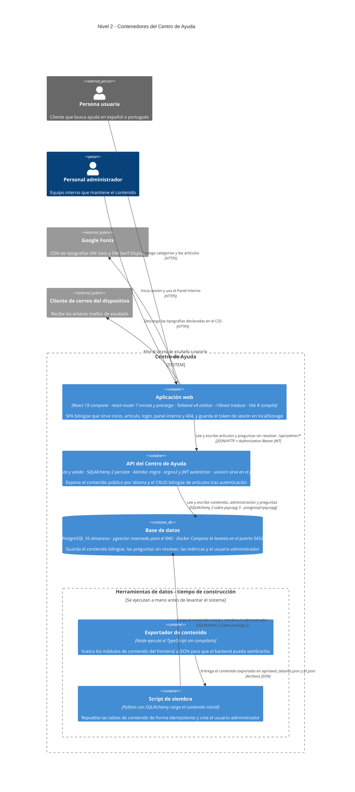

# C4 · Nivel 2 — Diagrama de contenedores

**Última revisión:** 2026-08-01 · **Commit de referencia:** `a6670ab` · **Rama:** `pruebas-ejecucion-y-afinado-de-agentes`

> Revisar este diagrama al modificar `app/package.json`, `api/pyproject.toml`, `docker-compose.yml`,
> `api/app/routers/` o `app/src/data/`. Si esos archivos han cambiado desde el commit de referencia,
> dar por sospechoso lo que se lea aquí.

Detalle interno del sistema descrito en [`c4-level1-context.md`](./c4-level1-context.md).

Son **cinco contenedores**: tres en ejecución (la SPA, la API y la base de datos) y dos scripts de
tiempo de construcción que preparan el contenido inicial y se ejecutan a mano, nunca en producción.
Cada tecnología y cada relación proviene de un archivo del repositorio; lo indeterminable está marcado
con `%% TODO: confirmar`.

## Cómo leer este diagrama

Notación [C4](https://c4model.com), nivel 2:

- **Persona** — alguien que usa el sistema. En azul oscuro si es interna a la organización, en gris si
  es externa.
- **Contenedor** — una unidad que se ejecuta por separado y se puede desplegar sola: una aplicación,
  una API, una base de datos.
- **Sistema externo** — en gris: software que no controlamos pero del que dependemos.
- **Borde del sistema** — la línea de puntos que separa lo que construimos de lo que solo consumimos.
- **Flecha** — una interacción real, etiquetada con su propósito y su protocolo.

## Tecnologías y por qué

Las etiquetas del diagrama resumen; esta sección es la fuente de la verdad.

### Aplicación web (`app/`)

| Tecnología | Qué hace | Por qué aquí |
| --- | --- | --- |
| React 19 | Construye la interfaz como componentes con estado propio | El prototipo de `design/` ya era una aplicación React con la accesibilidad resuelta: se portó en lugar de reescribirla |
| TypeScript 5.7 | Añade tipos estáticos que se comprueban antes de compilar | `src/types.ts` es el contrato compartido con la API; `tsc --noEmit` en `npm run build` detecta desajustes con el JSON que sirve el backend |
| Vite 8 | Servidor de desarrollo y empaquetador de producción | Arranque casi instantáneo y proxy `/api` → `localhost:8000`, que evita configurar CORS en desarrollo |
| react-router-dom 7 | Enruta por URL y carga datos con *loaders* antes de pintar | Permite el idioma en el primer segmento (`/es/…`, `/pt/…`) y traer el contenido sin `useEffect`; `guardiaPanel` protege el Panel Interno redirigiendo al login |
| Tailwind CSS v4 | Aplica estilos con clases de utilidad desde el propio marcado | Se integra como plugin de Vite, sin PostCSS ni archivo de configuración; el acento se expone como token `--acento` para recambiar la marca sin tocar componentes |
| i18next + react-i18next | Resuelve las etiquetas de interfaz según el idioma activo | Español y portugués son requisito desde el inicio, no un añadido posterior |
| Vitest 3 | Ejecuta los tests unitarios | Corre en entorno `node` sin DOM: cubre solo lógica pura, y así el proyecto evita introducir jsdom y Testing Library |

### API (`api/`)

| Tecnología | Qué hace | Por qué aquí |
| --- | --- | --- |
| Python 3.11+ | Lenguaje del backend | Se eligió por el RAG futuro: el ecosistema de recuperación y *embeddings* vive en Python |
| FastAPI | Framework web ASGI: enruta las peticiones HTTP y valida entrada y salida | Genera la documentación OpenAPI en `/docs` y permite que los esquemas reproduzcan `src/types.ts` campo a campo |
| Pydantic 2 | Declara y valida los esquemas de datos de la API | Los esquemas se serializan en camelCase para coincidir con el contrato del frontend sin capa de traducción |
| pydantic-settings | Lee la configuración desde variables de entorno y `.env` | Mantiene los secretos fuera del repo; la aplicación no arranca si falta `JWT_SECRET` |
| SQLAlchemy 2 | ORM: mapea las tablas a clases Python y construye el SQL | Soporta el modelo bilingüe de entidad estable más traducciones y, con `JSON().with_variant(JSONB())`, deja correr los tests en SQLite |
| Alembic | Versiona los cambios de esquema como migraciones ejecutables | Crea el esquema inicial y habilita `CREATE EXTENSION vector` desde la primera migración |
| psycopg 3 | Driver que conecta Python con PostgreSQL | Es el driver del dialecto `postgresql+psycopg` que usa la cadena de conexión |
| uvicorn | Servidor ASGI que ejecuta la aplicación | Servidor de referencia de FastAPI; recarga en caliente durante el desarrollo |
| argon2-cffi | Deriva y verifica el hash de la contraseña del administrador | Ganador del Password Hashing Competition: coste ajustable y resistente a ataques con GPU; la contraseña nunca se guarda recuperable |
| PyJWT | Firma y verifica el token de sesión HS256 | Sesión sin estado en el servidor; el token caduca a los 60 minutos y se valida en cada petición a `/api/admin/*` |
| pytest + httpx | Ejecutan las pruebas del backend | `TestClient` de FastAPI necesita httpx; las pruebas corren contra SQLite en memoria, sin depender de Docker |

### Base de datos

| Tecnología | Qué hace | Por qué aquí |
| --- | --- | --- |
| PostgreSQL 16 | Motor relacional que almacena y consulta los datos | Única base de datos del sistema: contenido, administración y métricas (filas de la tabla `metricas` sembradas por `seed.py`, no cálculos derivados) |
| pgvector | Añade el tipo `vector` y los índices de similitud | Se habilita desde la primera migración para no tener que cambiar de motor cuando llegue el RAG. **Hoy ninguna tabla lo usa** |
| Docker Compose | Levanta el servicio de base de datos | Entorno reproducible: puerto atado a `127.0.0.1`, volumen `pgdata` y *healthcheck* |

### Herramientas de datos

| Tecnología | Qué hace | Por qué aquí |
| --- | --- | --- |
| Node con *type stripping* | Ejecuta el exportador leyendo los módulos TypeScript directamente | Evita un paso de compilación para un script que solo se ejecuta al preparar el contenido |
| SQLAlchemy en `seed.py` | Vacía y repuebla las tablas de contenido de forma idempotente | Reutiliza los mismos modelos que la API, así el seed no puede divergir del esquema |

## Pendiente de confirmar

Lo que no se puede deducir del código. No son suposiciones: son preguntas abiertas.

- **Cómo se sirve la SPA en producción.** Hoy solo existe el proxy de desarrollo de Vite hacia
  `http://localhost:8000` (`app/vite.config.ts`); la API no registra CORS y el frontend usa rutas
  relativas, lo que apunta a un despliegue en el mismo origen, pero no hay nada en el repositorio que
  lo confirme. Lo resuelve quien defina el despliegue; hay un plan preliminar en
  [`docs/plans/infra-centro-ayuda-preliminar.md`](../plans/infra-centro-ayuda-preliminar.md).
- **Qué papel jugará pgvector.** La extensión se habilita en la primera migración
  (`api/alembic/versions/0001_inicial.py`) y ninguna tabla la usa. El diseño está en
  [`docs/plans/rag-centro-ayuda-preliminar.md`](../plans/rag-centro-ayuda-preliminar.md), sin
  implementar.

## Notas de lectura

- **La SPA es hoy la única consumidora de la API.** Todas sus URLs son relativas (`/api/...`); en
  desarrollo el proxy de Vite las reenvía al backend (`app/vite.config.ts:14-19`).
- **El contenido ya no es estático en tiempo de ejecución.** `app/src/data/index.ts:9` hace
  `fetch('/api/{idioma}/contenido')` desde un loader de ruta (`app/src/router.tsx:24-41`); los módulos
  `app/src/data/{es,pt}/` solo alimentan al exportador y a los tests de paridad es/pt.
- **La protección del panel en el cliente es cosmética.** `guardiaPanel` únicamente comprueba que
  exista un token en `localStorage` (`app/src/auth/sesion.ts`); la autorización real la impone
  `admin_actual` en el backend (`api/app/deps.py`), aplicada a nivel de router sobre todo `/api/admin/*`.
- **Endpoints que existen pero nadie consume**, y por eso no se dibujan como relación:
  `GET /api/admin/articulos` (el panel lista desde el contenido público), `POST /api/auth/logout`
  (el cierre de sesión es local) y `GET /api/salud`.
- **El chat no es una integración.** Renderiza una conversación fija del contenido, con citas que
  enlazan a artículos reales; no hay generación de respuestas.
- **El idioma vive en la ruta.** La SPA usa el primer segmento (`/es/…`, `/pt/…`) y su *loader* carga
  el contenido de **ambos** idiomas, porque el selector de idioma necesita el slug equivalente del
  artículo en el idioma destino (`app/src/data/index.ts`).
- **El modelo de datos es bilingüe por construcción.** Cada entidad tiene una fila estable y una fila
  de traducción por idioma, con las partes anidadas en JSONB (`api/app/models.py`). Por eso crear o
  editar un artículo exige español y portugués a la vez.
- **El orden de arranque importa.** `docker compose up -d` levanta Postgres, `alembic upgrade head`
  crea el esquema y la extensión `vector`, `node ../app/scripts/exportar-datos.mjs` vuelca el contenido
  a JSON y `python seed.py` lo siembra —este último falla si la migración no se ha aplicado antes—;
  solo entonces `uvicorn app.main:app --reload` sirve la API (`api/README.md`).

## Referencias en el código

| Contenedor | Archivos clave |
| --- | --- |
| Aplicación web | `app/package.json`, `app/src/router.tsx`, `app/src/data/index.ts`, `app/src/data/admin.ts`, `app/src/auth/sesion.ts`, `app/vite.config.ts` |
| API | `api/pyproject.toml`, `api/app/main.py`, `api/app/routers/`, `api/app/security.py`, `api/app/deps.py`, `api/app/servicios.py` |
| Base de datos | `docker-compose.yml`, `api/app/database.py`, `api/app/models.py`, `api/alembic/versions/0001_inicial.py` |
| Exportador | `app/scripts/exportar-datos.mjs` |
| Siembra | `api/seed.py` |
